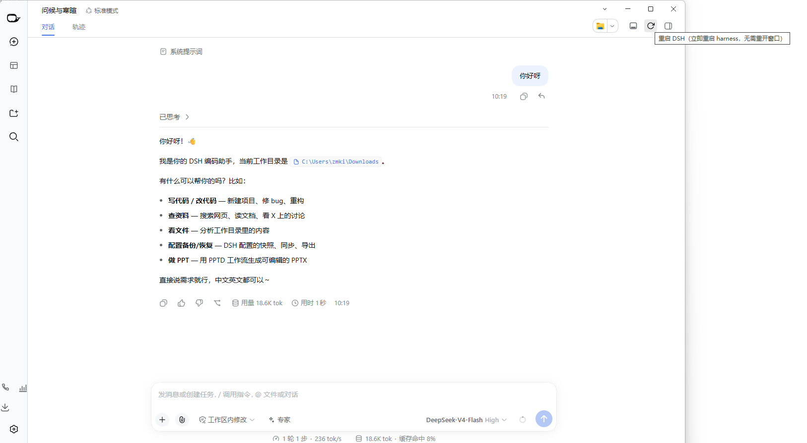
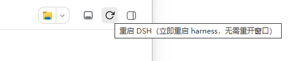

# dsh-desktop-restart

[中文](README.zh.md) | English

A one-click **restart** button in the DSH conversation header. It calls the DSH Desktop app's own
restart path — the same one behind the `Harness → Restart Harness` menu item — so the harness
restarts in place.

There is no shell script, no `lsof`, no port polling and no page reload: the packaged desktop app
already owns a restart channel, and this plugin is a button in front of it.



## Where the button is

The session header's right-hand utilities row, next to the file actions (open location, export
session): slot `conversation.session.header.utilities`.



| State | Look | Meaning |
| --- | --- | --- |
| idle | ↻ arrow, hover background | click to restart |
| busy | same arrow, spinning and dimmed | request sent, restart under way |
| sent | arrow turns green | the app accepted the restart |
| red | arrow turns red for 4 s, with a short label | no desktop bridge, or the bridge refused |

## Requirements

- **DSH Desktop** (the packaged Electron app). The button drives
  `globalThis.dshDesktop.restartHarness()`, which only exists in the desktop window's renderer.
- Opening the same web UI in an ordinary browser tab: the button renders, but clicking it reports
  `Desktop only` instead of restarting anything. This is deliberate — the desktop app's
  `harness:restart` IPC handler rejects every sender except its own main window, so there is no
  browser-side path to take.

## Install

```sh
dsh plugin --profile web add github:tecgic/dsh-desktop-restart
```

Then restart once (menu `Harness → Restart Harness`, or quit and reopen) — the bundle list is read
at boot, so a new plugin appears only after a restart.

Local checkout:

```sh
dsh plugin --profile web add link:/absolute/path/to/dsh-desktop-restart
```

## How it works

- **Host half** (`lib/index.js`): an empty `apply()`. It exists only so the Loader has a row to
  load; the browser half ships through `exports["./client"]` and the `dsh.client` declaration.
- **Client half** (`lib/client.js`): a hand-written client module
  (`window.__ModuleLoader__.load({ id, factory })`, no build step) that registers one component
  into the `conversation.session.header.utilities` slot and, on click, calls
  `globalThis.dshDesktop.restartHarness()`.
- `cordis.patch.yml` is a plain `insert` row, so the bundle is also hot-mountable by the market.

Because nothing runs on the host side, the plugin needs no RPC surface, no routes and no
permissions, and it installs from the git source with no build step or build approval.

## How it differs from other restart plugins

Most restart plugins run the restart from the host: they register an HTTP route, find the listening
PID, terminate it, respawn the same command line from a detached shell helper, then poll the port
until the server answers and reload the page. That approach also works under plain `dsh web`.

This plugin does none of that. It hands the request to the desktop app and lets the app restart its
own harness child, which means:

- no external commands (`lsof`, `kill`, a login shell) and no platform-specific process lookup;
- no detached second process and no chance of two harnesses racing for the same port;
- no page reload — the app reloads the window itself when the new harness is up;
- and, as the trade-off, **no plain-browser support**: outside the desktop window the bridge is
  absent, and the button says so.

## Uninstall

```sh
dsh plugin --profile web remove dsh-desktop-restart
```

or delete the `dsh-desktop-restart` entry from `dsh.profile.bundles` in the profile's
`package.json`, reinstall, and restart once.

## License

MIT
